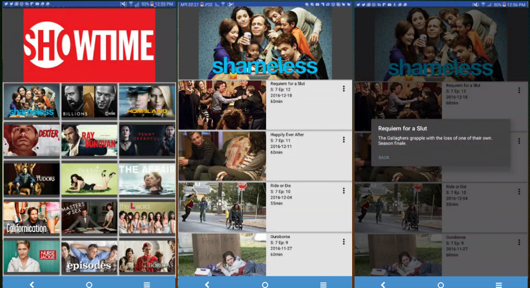
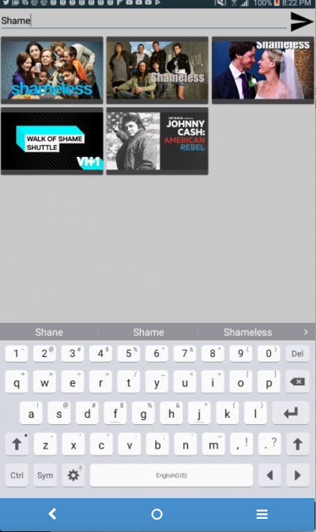

# StreamGuide

<h2>A TV guide that displays all the shows you can currently stream from any streaming app, all displayed in one place. </h2>

<h3>StreamGuide helps solves the problem of having TOO MANY APPS to stream television shows. Even Roku and Apple TV collect various apps the user needs to jump between. Netflix, Hulu, and Amazon all create their own original programing and networks are now developing their own apps. With StreamGuide, users can browse all available shows, then jump into the app after, instead of vice versa. (Currently in Pre-Alpha)</h3>

<h3>To prepare for this app, I survayed people on their television habbits. I was suprised (though I really shouldn't be) that people don't like to spend too much time browsing through potntial shows or movies on netflix the way I do. However, one problem I found was that most people didn't know what networks their favorite shows were available on. If apps go the way of tv, there will be (and already there are starting to be) apps for every single television station that hosts their own content on. That's all fine and dandy, but how do users find these shows? What if users don't know what apps to download?</h3>

The app pulls data from GuideBox, an API that collects data from various tv networks and streaming services. Calls are made using Retrofit. All the shows are displayed in a grid layout. The available networks are scrollable using a horizontal Recycler View. 

There is a detail activity that shows all shows from a network, and another detail activity that displays each episode of that series.

Users can also search by show title in the Search Activity.

<h2>User Stories</h2>

* User can browse shows of all genres and from various networks displayed on a single screen. 
* User can scroll through available networks. 
* User can see what shows are available from each network. 
* User can choose a show and enter a Detail Activity of that show. 
* User can search television shows by title. 
* User can scroll through available episodes of that show. 
* User can read the description of each episode. 
* User can Click the link to be taken to the app where the show is available. 
* If user doesn't have that app, user can click on that link and see the name of that link displayed in a snack bar. 

